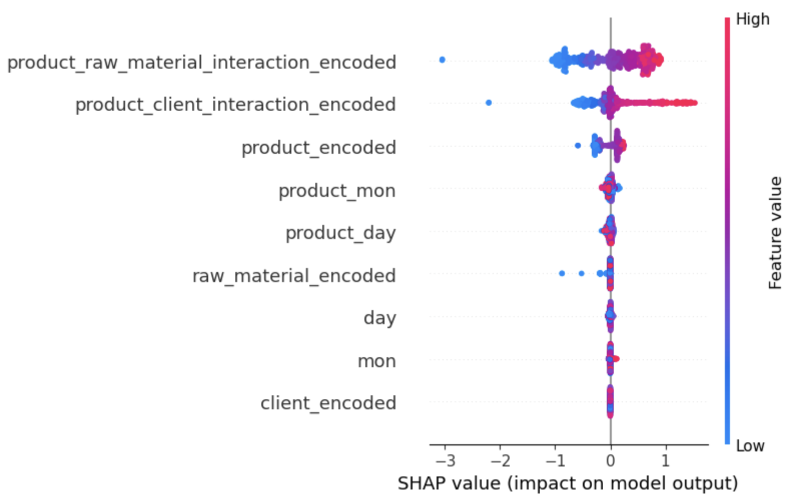
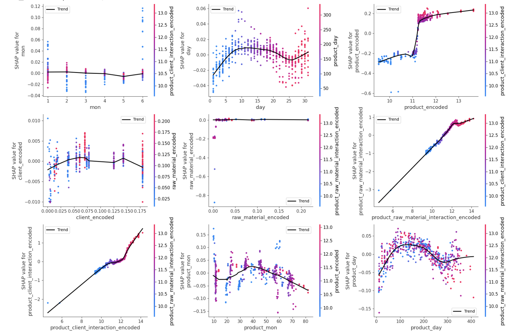

# 📊 Predicting Client Demand with Random Forest & SHAP  
*A Case Study of K Company’s Xinfeng Plant (Jan–Jun 2024)*  

---

## 🌐 Language / 語言  

- 🇺🇸 **English** (Current)  
- 🇹🇼 [**中文版本**](README_zh.md) *(Click here for Traditional Chinese version / 點此查看繁體中文版)*  

---

## 🚀 Overview  

In a dynamic and highly competitive market, **accurate demand forecasting** is the key to resource optimization and cost control.  
This repository presents a real-world case study applying **machine learning** to predict **client demand**, using **production and material consumption data** from K Company’s Xinfeng plant (2024.01–2024.06).  

We combine **Random Forest Regression (RF)** with advanced techniques in:  

- 📈 Feature Engineering  
- 🔍 SHAP (Shapley Additive Explanations) for interpretability  
- 🧠 Neural Network Baseline Comparisons  

---

## 🔍 SHAP Analysis & Key Insights  

To enhance model interpretability, we used **SHAP** to identify the most critical features affecting demand predictions.  

### **SHAP Summary Plot**  
The following SHAP plot shows the top factors influencing client demand:  

  

- **Product-related features** had the strongest impact.  
- **Product-material interactions** played a crucial role.  
- **Client-product relationships** showed significant variation in demand patterns.  

### **SHAP Feature Dependence**  
The SHAP feature dependence plot visualizes how the values of each feature influence the model’s prediction. It reveals the trends and relationships between feature values and their corresponding SHAP values, highlighting the strength and direction of each feature's impact on the model's predictions.
  
  

📊 **Findings:**  
- Some products exhibit **high SHAP values**, indicating strong demand predictability.  
- Others with **low SHAP values** may require strategic adjustments in production or supply chain.  

---

## 🛠️ Tech Stack & Tools  

- **Machine Learning:** Random Forest Regressor, SHAP, Neural Networks (NN), XGBoost (XGB), GBM, LSTM  
- **Data Processing:** Pandas, NumPy, Scikit-learn  
- **Visualization:** Matplotlib, Seaborn, SHAP plots  
- **Validation:** 5-Fold Cross-Validation & Kaggle Dataset Testing  

---

## 📊 Model Performance  

| Metric | RF (Test Set) | NN (Test Set) | GBM (Test Set) | XGBoost (Test Set) |
|--------|---------------|---------------|----------------|--------------------|
| R²     | 0.849         | 0.797         | 0.816          | 0.814              |
| MAE    | 0.393         | 0.458         | 0.434          | 0.434              |
| MSE    | 0.260         | 0.321         | 0.317          | 0.319              |
| RMSE   | 0.510         | 0.566         | 0.563          | 0.565              |

✅ **5-Fold Cross Validation** confirms model stability  
✅ **Kaggle test set R²: 0.98**, validating scalability  

---

---

## 💡 Contribution  

This study demonstrates how **interpretable machine learning** can support data-driven decision-making in **real industrial settings**. SHAP analysis not only enhances transparency but also bridges the gap between predictions and business strategy.  

---

## 📬 Contact  

If you find this project interesting or want to collaborate, feel free to reach out!  

> **Author:** [Ming]  
> **Affiliation:** Institute of Big Data, Department of Applied Mathematics, National Chung Hsing University  
> **Email:** ccit0915@gmail.com  

---

## ⭐ If you find this repo helpful, give it a ⭐ to support the project!  

